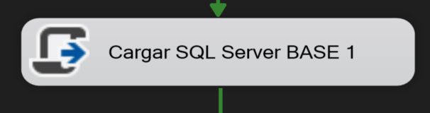
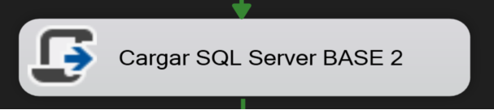
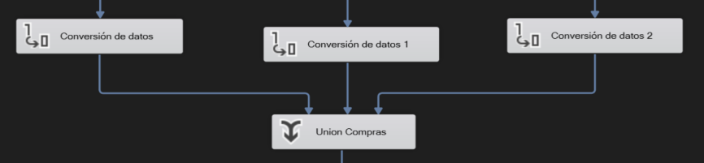
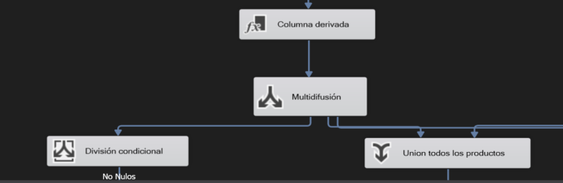
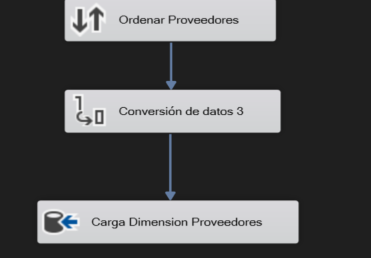
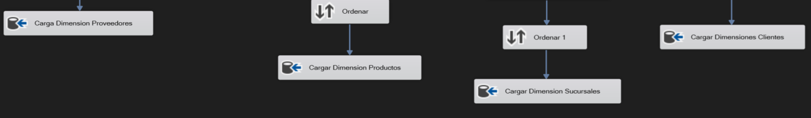
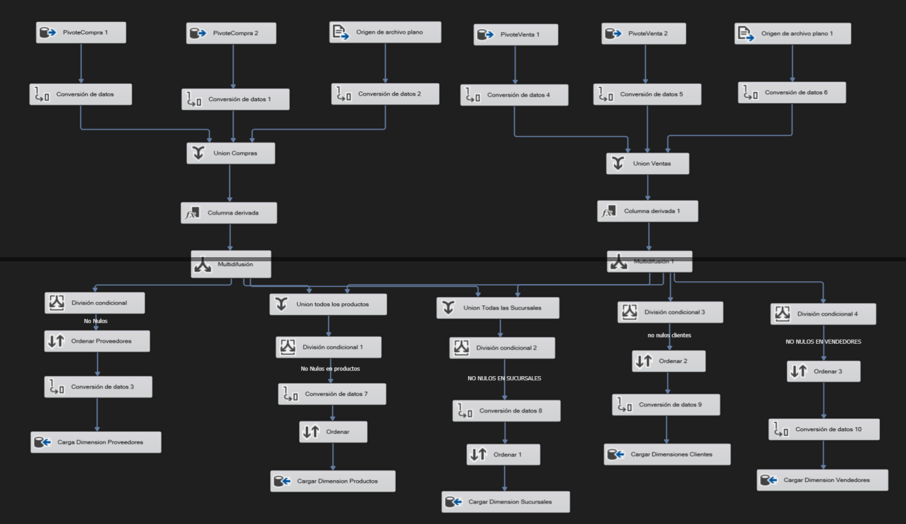
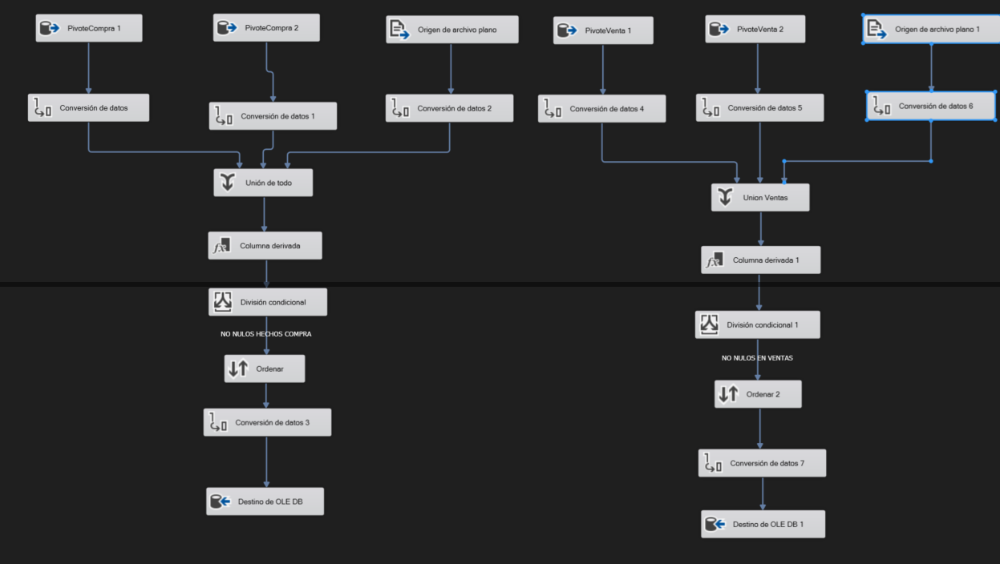
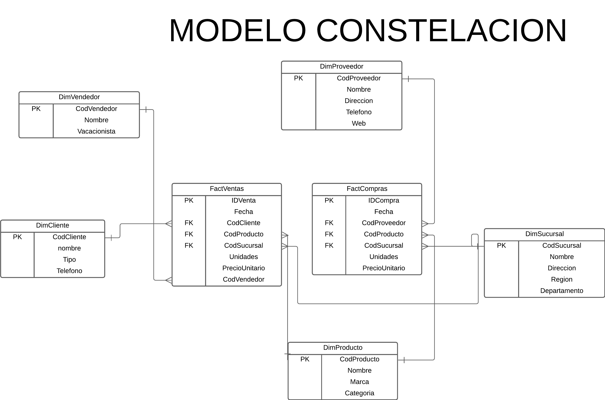

# SG-Food Inteligencia y Control: Optimización Total de Ventas e Inventarios
Jonatan Leonel Garcia Arana
 
## Proceso de ETL
### Extracción
Se extrajo la información de los archivos .comp y .vent, los cuales contienen la información de las compras y ventas respectivamente. En total eran 6 archivos, 3 de compras y 3 de ventas.

El contenido de estos archivos se cargó a 3 orígenes diferentes (2 bases de 
datos y directo de los archivos) todo esto con las herramientas de business 
intelligence que ofrece Microsoft Visual Studio 2019. Se utilizaron los siguientes orígenes de datos:

**SQL Server:**  
Se extrajo la información de las compras y ventas de los archivos `SGFood01.comp`, `SGFood01.vent`,`SGFood02.comp`, `SGFood03.vent` respectivamente, luego estos datos fueron cargados en dos tablas temporales, una para compras y otra para ventas, creadas previamente en la base de datos de SQLServer, la cual se encuentra en el servidor local.   En Visual Studio  se realizó mediante una tarea de Script SQL, en la cual se ejecutó un script que carga los datos de los archivos a las tablas temporales de SQL. 

 
 

**Archivo de texto plano:**  
Se extrajo la información de las compras y ventas de los archivos `SGFood03.comp` y `SGFood03.vent` directamente mediante las herramientas de Visual Studio 
 
### Transformación
Los datos fueron analizados y limpiados y transformados para que cumplan con las necesidades del modelo de datos. Se realizaron las siguientes transformaciones:
- Eliminación de registros duplicados.	
- Eliminación de registros con valores nulos.
- Eliminación de registros con valores negativos.
- Eliminación de registros con valores atípicos.
- Conversión de tipos de datos.

En Visual Studio se utilizó la herramienta de Data Flow para realizar las transformaciones de los datos. Se utilizaron los siguientes componentes para realizar las transformaciones:
- **Data Conversion:** Se utilizó para realizar la conversión de tipos de datos.
- **Derived Column:** Se utilizó para realizar la conversión de tipos de datos.
- **Conditional Split:** Se utilizó para eliminar los registros con valores nulos, negativos y atípicos.
- **Sort:** Se utilizó para ordenar los registros.

   
 
 
 

### Carga
Se crearon las tablas de dimensiones y hechos del Data Warehouse en una base de datos de SQL Server. Los datos transformados se cargaron a las tablas de dimensiones y hechos del Data Warehouse. Se utilizó Integration Services de Visual Studio para realizar la carga de datos.

En Visual Studio  se utilizó la herramienta de Data Flow para realizar la carga de los datos. 
   
 

### Flujo General
- Tablas de Dimensiones
 

 
- Tablas de Hechos
 

 

## Modelo Implementado Data Warehouse

Se utilizó el modelo constelación para el diseño del Data Warehouse, el cual consiste en un modelo Constelacion con 2 tablas de hechos y varias tablas de dimensiones.

La razón principal por la que se utilizó el modelo de constelación para el diseño del Data Warehouse es que ofrece flexibilidad y escalabilidad, permitiendo gestionar múltiples procesos de negocio en un único esquema de almacenamiento de datos. En este caso, al manejar tanto ventas como compras, el modelo de constelación es ideal porque permite la creación de dos tablas de hechos (una para ventas y otra para compras), que están relacionadas con un conjunto compartido de tablas de dimensiones.

### Tablas de Dimensiones
Se crearon cinco tablas de dimensiones, las cuales son:

- **Producto:**
    Almacena la información de los productos, como el código, nombre, marca y categoría.
- **Proveedor:**
    Almacena la información de los proveedores, como el código, nombre, dirección, número de teléfono y web.
- **Sucursal:**
    Almacena la información de las sucursales, como el código, nombre, dirección, región y departamento.
- **Cliente:**
    Almacena la información de los clientes, como el código, nombre completo, tipo, dirección y número de teléfono.
- **Vendedor:**
    Almacena la información de los vendedores, como el código, nombre completo y si es vacacionista o no.

### Tablas de Hechos
Se crearon dos tablas de hechos, una para las ventas y otra para las compras.
- **Compra:**
    Almacena las llaves surrogadas de las dimensiones de proveedor, producto y sucursal. La métricas que guarda son costo unitario, unidades y la fecha de la compra como atributo.

- **Venta:**
    Almacena las llaves surrogadas de las dimensiones de cliente, vendedor, producto y sucursal. La métricas que guarda son precio unitario, unidades y la fecha de la venta como atributo.
